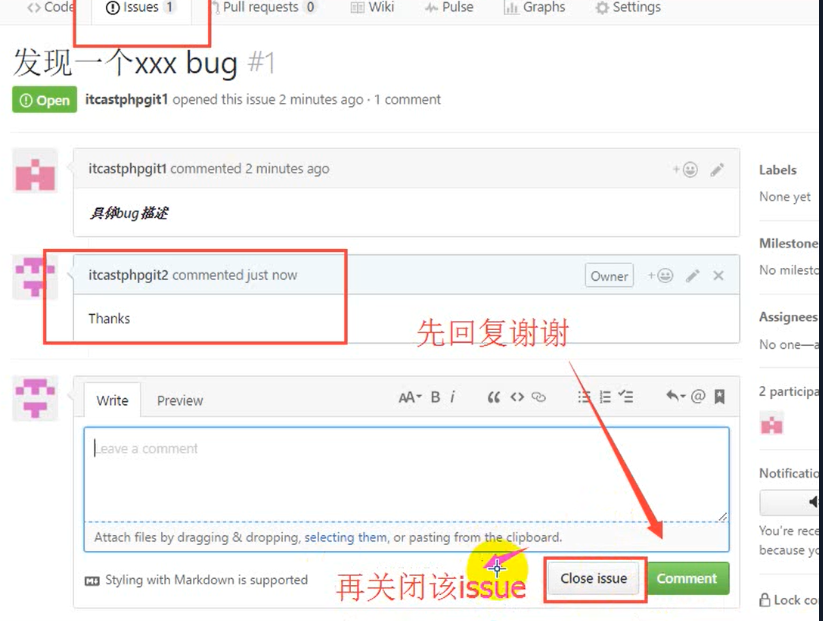

# Github&&Git

---

# Github

---

### 一、Github用户信息

> 用户名 :cainiaoing (个人)

---

### 二、为什么学习github

1. 学习优秀的开源项目 (开源项目 ：开放式源代码项目 )
2. 关注行业前辈 了解最新的行业动态 
3. 目的 :借助github托管项目代码 

---


### 三、概念

#### 1.仓库（Repository）

表示你的项目，你想要在Github上开源一个项目，那就必须新建一个Repository，如果你的开源项目多了，你就拥有了多个repositories。

#### 2.收藏（Star）

仓库主页star按钮 ，意思为收藏项目的人数 ，在github上 如果你有一个项目获得100个star都算很不容易了 。(自己收藏别人的项目是为了下次更好的查看 )

#### 3.复制克隆项目 (Fork )

1. 你开源了一个项目,别人想在你这个项目的基础上做一些改进 ,这个时候 他就可以fork你的项目 ,然后他的github主页上就多了一个项目 ,只不过这个项目是基于你的项目基础 ,(本质上是在原有的项目的基础上新建了一个分支 ), 他就可以随心所欲的去改进 但是丝毫不会影响原有的项目的代码与结构 .

2. 实例：原先张三有一个仓库李四 没有仓库，你是点击张三仓库右上角的fork 李四便在个人中心得到了一个一模一样 的仓库 ，并且这些仓库的内容可以自己改写  

3. 在fork的项目是独立存在的 ，李四修改张三的项目， 张三的人仓库里的项目是不会改变的

   

#### 4. 发起请求 (Pull Request )

李四在复制张三的仓库中新建了一个文件 ，然后pull request张三 ，你是查看的时候 如果感觉不错的话 他会把李四的文件合并到张三的仓库中 


#### 5.关注 (Watch )

关注项目，当项目更新可以接受到通知

#### 6. 事务卡片 (Issue)

发现代码有BUG,新建一个 Issue,发一个消息 ,一起来讨论(是否是 bug)时使用 ,或者给一个解决方案

---


### 四、 创建仓库/创建新项目 

#### 1.说明 

一个git库(仓库)对应一个开源项目 ，通过 git管理git库

#### 2. 主页

##### （1）Github主页 

该页左侧主要显示用户动态以及关注用户或关注仓库的动态(比如这个仓库添加了一个文件 ) ，右侧显示所有的git库


##### （2）仓库主页 

仓库主页主要显示项目的信息 ，如项目代码，版本， 收藏/关注/fork情况等 

##### （3）个人主页 

个人信息 ：头像 ，个人简历 ，关注我的人 ，我关注的人 ，我关注的git库，我的开源项目 ，我贡献的开源项目等信息 

##### （4）英文小知识

sign in 登录 sign up 注册 

##### （5）注意 :

1. Github在国外服务器 所以访问较慢或者无法访问 需要翻墙 (shadosocks )
2. 私有仓库只能自己或者指定朋友看，（私有仓库是收费的，美元），现在免费了
3. 新注册的用户必须验证邮箱才能使用

#### 3.创建（仓库）流程

##### 1、初次登陆(注册)注意（邮箱验证）

1. 点击start a project -> 进入页面 – > 点击发送验证邮箱 – > 点击resend  - > 在邮箱中验证 –> qq邮箱需要设置白名单才可以收到邮件
2. 如何设置白名单：打开qq邮箱  -  >  点击设置  ->  点击反垃圾  - >  点击设置域名白名单 - > 输入github .com  - > 点击添加到域名白名单  – > 在接收到邮箱之后  – > 点击 emil address  - >   再次打开github主页 ~点击 start a project~就可以创建仓库啦 

##### 2、具体创建仓库操作

项目名称 – > Description (项目描述 )  – > 点击public  - > 勾选README（readme）复选框  – > 点击创建仓库


##### 3、创建好之后进入仓库主页

1. 点击仓库进入仓库主页，进入用户名，进入用户主页（以下是仓库主页）


##### 4. 仓库管理

##### （1）创建仓库文件

1. (Edit new file) – > 输入项目名称加语言后缀  –  >  输入文件内容  –  >  在commit new file中(对文件进行说明，  - >  (  知道为什么开发这个文件：标题+内容)

   


2. preview:对刚才创建文件(Edit new file)的内容进行效果预览

3. commit new file

   

4. 创建后自动回到仓库主页（展示以下内容）

   

##### （2）仓库编辑

1. 编辑文件(删除/创建)也算是一次提交

2. 第一步：（进去之后修改即可）点击文件名
3. 第二步：（了解）
4. 第三步：（了解）
5. 第四步：
6. 第五步：点击仓库名回到仓库主页

##### （3）删除文件

1. 第一步
2. 第二部：删除相应的文件即可
4. 第四步：提交
5. 第五步：删除文件如何查看：当你删除文件后，删除的文件就不存在了，可以通过commits查看删除文件

##### （4）文件上传

1. 第一步：
3. 第二部：

##### （5）搜索仓库文件

方便找到自己在仓库写的内容

1. 第一步：

   

2. 第二步：

   

3. 可以用快捷键t（t不区分大小写）

##### （6）下载/检出项目

1. 第一步：进入仓库主页
2. 

#### 4. Github lssues

1. 作用 ：发现代码bug ，但是目前还没有成型的代码 ，需要讨论时用 ，或者使用开源项目出现问题时使用（issue界面） 

   

   然后进行如下操作

   

   

   在新建new issue 之后，点击提交就可以了

2. 情景 ：张三发现李四开源git库 ,张三刚发提交了一个 issue;李四隔天登陆在 github主页看到通知并和张三交流 ,最后关闭 issue

   





### 五、基础概念实战

#### 1. Github主页


#### 2. 仓库主页

略

#### 3.个人主页

1. 进入个人主页方式

   

2. 个人主页界面


#### 4.仓库（Repository）

1. 一个仓库只能存放一个开源项目

#### 5.收藏（star）

1. 【如何收藏】打开对应项目主页即可收藏

   

收藏后显示unstar ，表示取消收藏

2. 【如何查看自己的收藏 】

   

这样一来左下角会出现收藏的项目列表


#### 6.关注（Watch）

1. 【情景】张三关注了李四的项目 ，你是添加项目文件 ，或对其进行修改 ，张三的 Github主页 会有关注用户动态的显示 (李四所有的对自己仓库的动作 张三都能关注到 )

   

   

   之后在git2有动作后，git1界面会有显示

   

2. 切记：是一个仓库 ，仓库内有一个开源项目

#### 7.复制或克隆项目（Fork）

1. 【情景】自己在 Fork 了别人的仓库后 ，自己就可以进行编辑 ，而对别人的仓库没有影响 （单独存在）


#### 8. 发起请求（Pull ruquest）

1. 【情景】自己想要fork别人后的仓库 进行修改后，在与别人的仓库进行同步 (先经过的Fork)

   - git1向git2发送一个更新请求（经以下三步）

   

   ---

   

   ---

   

   - git2进行同步处理

   ---

   

---


#### 9.事务卡片（Issue）

#### 10. 开源项目的贡献流程

##### 1.新建 issue

提交使用问题或者建议或者想法

##### 2.pull Request

直接修正代码来解决问题 
步骤：1.Fork项目 
            2.修改自己仓库的项目代码 
           3.新建pull request
            4.等待 作者操作审核


### 六、高效使用github寻找开源项目

1. 不加限定词汇去搜索，在左上角搜索你要找的项目，（in this user各人用户去查开源项目，All github,在所有的github用户中去查开源项目）

2. 加一些限定词汇

   ```c
   //这些寻找方法可以叠加查找。
   按照项目名/仓库名搜索（大小写不敏感）
        in:name xxx
   按照readme搜索
        in:readme xxx
   按照description搜索(限定词汇)
        in:description xxx
   按照stars数大于xxx
        stars:>xxx
   按照forks数大于xxx
        forks:>xxx
   编程语言为xxx
        language:xxx
   ```


---


# Git

---

## 一、如何安装Git

### 1.git官网 

[git官网]:https://git-scm.com/download/win

### 2.双击安装

### 3.安装注意事项

### 4.选择组件开(像命令行之类的)


### 5.开始菜单目录名设置 


### 6.选择使用命令行环境 


### 7.以下三步默认为next 

### 8.安装好之后需要检验 是否安装成功


---

## 二、Git的基本工作流程

### 1、Git工作区(Working directory )

- Git Repository(Git仓库 ) 最终确定的文件保存到仓库，成为一个新版本 并对他人可见 
- 暂存区 暂存 已修改的文件 最后统一提交到git仓库中 (先提交到暂存区 然后再提交到git仓库中 )
- 工作区 （Working Directory)添加 编辑  修改文件等动作 

### 4、向仓库中添加文件流程 

1–> 2–> 3(用命令行向仓库添加文件)

（假设文件在工作区）（假设有两个文件test.php, world.php）

1. 从工作区提交到暂存区

   先查看文件状态：输入命令行：git status

   再提交到暂存区：输入命令行：git add test.php  

   ​                                                         git add world.php

2. 从暂存区提交到仓库

   先看文件状态： 输入命令 ： git status

   在提交文件：     输入命令：git commit -m"提交描述"

   ​                                                 git commit -m "提交描述"

​       （提交描述）：在github中提交项目都会有描述

​         在输入命令 ： git status

## 三、Git 初始化及仓库的创建和操作

只对自己建的文件夹中更改，github仓库并没有改变

#### 1. 基本信息设置

1. 设置用户名
   git config – –global user.name 'cainiaoing'
2. 设置用户名邮箱 
   git config – –global user.email '2892915071@qq.com'

脚下留心：该设置在github仓库主页显示了谁提交了该文件


#### 2.初始化一个新的Git仓库

##### 1.Linux小知识

(学习Linux 官网 ：www.itcast.cn ) 视频下载 点击一下 找到相关的Linux 

ls:查看当前文件夹 
       pwd:显示当前目录 
      clear:清空当前所有操作 
      vi/vim 文件名.文件类型：对所选文件进行内容的输入 (添加内容 )

删除文件：rm –rf 文件名.文件类型

：wq   表示对输入文件进行保存

mkdir test (命令 空格 文件名)；创建一个文件名为test文件（以test文件为例）

touch 文件名.文件类型(c,c++)   //新建一个编程代码文件，只是一个文件，没有内容


##### 2.开始操作

在桌面新建一个文件夹 ，双击进去–> 鼠标右击 –>  点击 Git bash here (用命令行模式)  （主文件一级文件夹）mkdir test,创建文件夹，文件夹名子为test.

##### 3.初始化

1. 将设置用户名的两个信息 挨个复制黏贴回车  完成初始化啦（只需要初始化一次，该文件夹就记住了，所以初始化一次就好）

   

2. 注意：该设置在github仓库主页显示谁提交了该文件 

##### 4.查看设置

验证的话，git config --list    便可以察看提交的初始化的信息

##### 5. 初始化一个新的git仓库 

1、创建文件夹 (方式)  （副文件 二级文件夹）

方式一：⑴在终端输入命令 mkdir test (命令 空格 文件名)

方式二：⑵在工程目录里 右击一个新的文件夹 

2、在文件内初始化git(创建git仓库 )  (在二级文件里面)

⑴cd test(cd 文件名)：表示进入test文件里      或者     双击test文件- > 进入后右击 - > Git bash here 是一样的效果
⑵git init :会出现一个隐藏文件 (如果看不见 则设置电脑显示隐藏文件 )  (三级文件夹)

初始化仓库以后，回生成一个.git文件

#### 3、向仓库中添加文件


在.git文件里面终端操作

 在终端输入文件： touch 文件名.文件类型(c,c++)   //新建一个编程代码文件，只是一个文件，没有内容


1. 从工作区到暂存区
   输入命令：git status
   输入命令：git add 文件名.文件类型(c,c++)
   
   
   
2. 从暂存区到仓库
   输入命令：git status
   输入命令：git commit -m 'add a.php(文件的相关描述)'
   输入命令：git status(查看是否提交成功 )

   

#### 4. 修改仓库文件

1. 从工作区添加到暂存区 
   ⑴输入命令：git.status      如果没有内容的话 
       输入命令：vi/vim 文件名.文件类型 (修改文件 ) 
        回车–> 输入添加的内容 –> 在最下面一行输入 ：wq(保存 )
        此时该文件已经有了输入的内容 
    (2)输入命令行git status 便可以查到修改的内容 
2. 从暂存区添加到仓库 
   ⑴输入命令：git status 
   输入命令：git commit –m'文件相关描述'
   (2)输入命令：git status

#### 5.删除仓库文件

1. 删除文件
   输入命令：git status 
   输入命令行 ：rm –rf 文件名.文件类型

2. 从git中删除文件 (删除暂存区的文件 )
   输入命令：git status 
   输入命令：git rm 文件名.文件类型

3. 提交操作 

   输入命令：git status 
   输入命令：git commit –m '文件相关描述'
   输入命令：git status 

## 四、Git管理远程仓库

在建立的文件夹，之后通过管理远程仓库实现 Github仓库更改

#### 1.使用远程仓库的目的 

作用 :备份 实现代码共享集中化管理 

#### 2.Git远程仓库 


---


#### 3.Git克隆操作 

   1、目的 

​      将远程仓库 (github 对应的项目 )复制到本地 

   2、代码
     输入命令行   git clone 仓库地址
     (仓库地址的由来 )复制黏贴即可


---


---


#### 4.将本地仓库同步到远程git仓库中

1、在桌面的新建文件夹中(一级文件夹 )  为了防止文件夹的冲突 最好把原来的文件夹给删掉 右击 git bush here 

2、输入命令：git clone 仓库地址(不用初始化啦 只初始化一次就可以 )

(https://github.com/cainiaoing/algorithm.git)我的地址

3、此时会下载Github仓库中(开源项目 )的文件 


4、对相应的文件 进行修改 编辑 删除 等一系列操作 

5、还是从工作区到暂存区  从暂存区到仓库

6、将本地仓库同步到git远程仓库中 
       输入命令：git push(必须保证初始化的用户名和qq邮箱号都一样 ，否则是不对的 )
       需要时间等待 


#### 5、为什么为什么无法同步或者没有权限 

（The requested URL returned error: 403 Forbidden while accessing）

​    答案 ：私有项目没有权限输入用户密码或者远程地址采用这种类型 ：
​    输入命令行： vi .git/config
​    对以下图片中的内容进行修改即可

